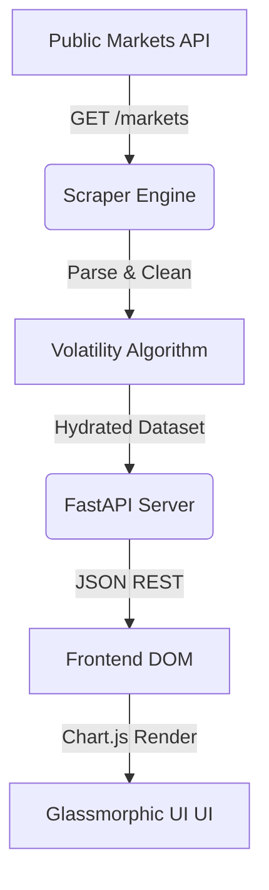

# Crypto Scanner Pro 🚀

A highly-performant, real-time cryptocurrency scanning engine and algorithmic dashboard. Built for strict performance and breathtaking analytics visualization.

> This project features a full-stack **Python & FastAPI** architecture bridging standard REST pipelines into a **Glassmorphic** vanilla Javascript dashboard.


## 🔥 Core Features
- **Algorithmic Volatility Engine:** Identifies "Hyper-Volatile" assets operating under massive 24h market swings.
- **Glassmorphic Dashboard:** Deep dark-mode styled frosted glass user interface powered entirely without heavy JS frameworks.
- **Gradient Sparklines:** Real-time Chart.js integration parsing arrays directly from CoinGecko.

---

## 🛠 Architecture


## 🚀 Getting Started

Deploying the architecture locally:

**1. Initialize the Python environment**
```bash
pip install -r requirements.txt
```

**2. Boot the API Engine**
```bash
uvicorn backend.main:app --reload
```
The server will bind strictly to `localhost:8000`.

**3. Assess Live Market**
Navigate directly to `http://127.0.0.1:8000` to view the UI.
